# Flowmap Sistem Berjalan
## Sistem Informasi Pemesanan Tiket Wisata Istana Pasir

Dokumen ini menjelaskan **flowmap sistem berjalan** pada aplikasi pemesanan tiket wisata Istana Pasir. Flowmap disusun berdasarkan alur yang saat ini diterapkan pada sistem: registrasi/login pengunjung, pemesanan tiket, unggah bukti pembayaran, verifikasi admin, penerbitan e-ticket, validasi tiket oleh petugas, serta pemantauan laporan oleh owner.

---

## 1. Aktor yang Terlibat

| Aktor | Peran dalam Sistem |
|---|---|
| **Pengunjung** | Melakukan registrasi/login, memilih tiket, membuat pemesanan, mengunggah bukti pembayaran, dan menggunakan e-ticket. |
| **Sistem** | Memvalidasi data, menyimpan transaksi, menghitung total pembayaran, mengurangi stok tiket, menyimpan bukti pembayaran, membuat e-ticket, dan mengubah status data. |
| **Admin** | Mengelola data tiket, memeriksa data pemesanan, memverifikasi pembayaran, dan melihat laporan. |
| **Petugas** | Memvalidasi e-ticket/QR Code di pintu masuk dan mengubah status tiket menjadi digunakan. |
| **Owner** | Melihat dashboard laporan pendapatan, jumlah pengunjung, transaksi, dan performa tiket. |

---

## 2. Flowmap Sistem Berjalan Utama

```mermaid
flowchart TD
    A([Mulai]) --> B[Pengunjung membuka website]
    B --> C{Sudah punya akun?}
    C -- Tidak --> D[Pengunjung melakukan registrasi]
    D --> E[Sistem menyimpan data akun pengunjung]
    C -- Ya --> F[Pengunjung login]
    E --> F
    F --> G{Login valid?}
    G -- Tidak --> F
    G -- Ya --> H[Pengunjung masuk dashboard]

    H --> I[Pengunjung memilih menu pesan tiket]
    I --> J[Sistem menampilkan data tiket yang stoknya tersedia]
    J --> K[Pengunjung memilih jenis tiket, jumlah tiket, dan tanggal kunjungan]
    K --> L{Stok mencukupi dan data valid?}
    L -- Tidak --> K
    L -- Ya --> M[Sistem membuat data pemesanan status pending]
    M --> N[Sistem menghitung total harga dan mengurangi stok tiket]
    N --> O[Pengunjung masuk halaman checkout]

    O --> P[Pengunjung melakukan transfer bank manual]
    P --> Q[Pengunjung mengunggah bukti pembayaran]
    Q --> R{Tanggal kunjungan masih berlaku?}
    R -- Tidak --> S[Sistem menolak upload dan pemesanan dianggap tidak dapat dibayar]
    S --> T[Pengunjung membuat pemesanan baru jika diperlukan]
    R -- Ya --> U[Sistem menyimpan bukti pembayaran dengan status pending]

    U --> V[Admin membuka data pembayaran]
    V --> W[Admin memeriksa bukti pembayaran]
    W --> X{Pembayaran valid?}
    X -- Tidak --> Y[Admin menolak pembayaran]
    Y --> Z[Sistem mengubah status pembayaran menjadi gagal dan pemesanan tetap pending]
    Z --> Q

    X -- Ya --> AA[Admin menyetujui pembayaran]
    AA --> AB[Sistem mengubah status pembayaran menjadi berhasil]
    AB --> AC[Sistem mengubah status pemesanan menjadi dibayar]
    AC --> AD[Sistem membuat e-ticket dengan kode QR unik]
    AD --> AE[Pengunjung melihat/mengunduh e-ticket]

    AE --> AF[Pengunjung datang ke lokasi wisata]
    AF --> AG[Petugas scan/input kode QR e-ticket]
    AG --> AH{E-ticket valid dan belum digunakan?}
    AH -- Tidak --> AI[Petugas menolak tiket]
    AH -- Ya --> AJ[Petugas memvalidasi tiket]
    AJ --> AK[Sistem mengubah status e-ticket menjadi digunakan]
    AK --> AL[Sistem mengubah status pemesanan menjadi selesai]
    AL --> AM[Owner/Admin melihat laporan transaksi dan pengunjung]
    AM --> AN([Selesai])
```

---

## 3. Flowmap Berbasis Swimlane/Aktor

```mermaid
flowchart LR
    subgraph P[Pengunjung]
        P1[Registrasi/Login]
        P2[Pilih tiket, jumlah, dan tanggal kunjungan]
        P3[Konfirmasi pemesanan]
        P4[Transfer manual]
        P5[Upload bukti pembayaran]
        P6[Lihat/unduh e-ticket]
        P7[Datang ke lokasi wisata]
    end

    subgraph S[Sistem]
        S1[Validasi akun/login]
        S2[Tampilkan tiket tersedia]
        S3[Validasi stok dan data pemesanan]
        S4[Simpan pemesanan status pending]
        S5[Hitung total harga dan kurangi stok]
        S6[Simpan pembayaran status pending]
        S7[Update pembayaran berhasil/gagal]
        S8[Generate e-ticket dan kode QR]
        S9[Update tiket digunakan dan pemesanan selesai]
        S10[Sediakan data laporan]
    end

    subgraph A[Admin]
        A1[Kelola data tiket]
        A2[Lihat data pemesanan]
        A3[Periksa bukti pembayaran]
        A4[Setujui/Tolak pembayaran]
        A5[Lihat laporan penjualan]
    end

    subgraph G[Petugas]
        G1[Scan/input kode QR]
        G2[Validasi tiket masuk]
    end

    subgraph O[Owner]
        O1[Lihat dashboard laporan]
        O2[Pantau pendapatan dan jumlah pengunjung]
    end

    P1 --> S1
    S1 --> P2
    A1 --> S2
    P2 --> S2
    S2 --> P3
    P3 --> S3
    S3 --> S4
    S4 --> S5
    S5 --> P4
    P4 --> P5
    P5 --> S6
    S6 --> A3
    A2 --> A3
    A3 --> A4
    A4 --> S7
    S7 -- Disetujui --> S8
    S7 -- Ditolak --> P5
    S8 --> P6
    P6 --> P7
    P7 --> G1
    G1 --> G2
    G2 --> S9
    S9 --> S10
    S10 --> A5
    S10 --> O1
    O1 --> O2
```

---

## 4. Uraian Proses Sistem Berjalan

### 4.1 Registrasi dan Login

1. Pengunjung membuka website Istana Pasir.
2. Jika belum memiliki akun, pengunjung melakukan registrasi.
3. Sistem menyimpan data akun pengunjung.
4. Pengunjung login menggunakan akun yang sudah terdaftar.
5. Sistem memvalidasi kredensial login.
6. Jika valid, pengunjung diarahkan ke dashboard pengunjung.

### 4.2 Pemesanan Tiket

1. Pengunjung memilih menu pemesanan tiket.
2. Sistem menampilkan daftar tiket yang stoknya masih tersedia.
3. Pengunjung memilih jenis tiket, jumlah tiket, tanggal mulai kunjungan, dan tanggal akhir kunjungan.
4. Sistem memvalidasi data pemesanan dan ketersediaan stok tiket.
5. Jika data valid dan stok mencukupi, sistem membuat data pemesanan dengan status **pending**.
6. Sistem menghitung total harga berdasarkan harga tiket dikalikan jumlah tiket.
7. Sistem mengurangi stok tiket sesuai jumlah tiket yang dipesan.
8. Pengunjung diarahkan ke halaman checkout.

### 4.3 Pembayaran Manual

1. Pengunjung melihat ringkasan pemesanan dan informasi rekening transfer.
2. Pengunjung melakukan pembayaran melalui transfer bank manual.
3. Pengunjung mengunggah bukti pembayaran berupa gambar dengan format `.jpg`, `.jpeg`, atau `.png`.
4. Sistem memeriksa apakah tanggal kunjungan masih berlaku.
5. Jika tanggal kunjungan sudah lewat, sistem menolak pembayaran dan pengunjung perlu membuat pemesanan baru.
6. Jika masih berlaku, sistem menyimpan data pembayaran dengan status **pending**.

### 4.4 Verifikasi Pembayaran oleh Admin

1. Admin membuka halaman data pembayaran.
2. Admin melihat daftar bukti pembayaran yang masih menunggu validasi.
3. Admin memeriksa bukti pembayaran.
4. Jika pembayaran tidak valid, admin menolak pembayaran.
5. Sistem mengubah status pembayaran menjadi **gagal** dan status pemesanan tetap **pending**.
6. Jika pembayaran valid, admin menyetujui pembayaran.
7. Sistem mengubah status pembayaran menjadi **berhasil**.
8. Sistem mengubah status pemesanan menjadi **dibayar**.
9. Sistem membuat e-ticket dengan kode QR unik.

### 4.5 Penggunaan E-Ticket oleh Pengunjung

1. Pengunjung membuka halaman e-ticket setelah pembayaran disetujui.
2. Sistem menampilkan e-ticket berisi detail pemesanan dan kode QR.
3. Pengunjung datang ke lokasi wisata dengan membawa e-ticket.
4. Petugas melakukan scan/input kode QR.
5. Sistem memeriksa kode QR.
6. Jika kode QR tidak ditemukan atau tiket sudah digunakan, tiket ditolak.
7. Jika valid, petugas memvalidasi tiket.
8. Sistem mengubah status e-ticket menjadi **digunakan**.
9. Sistem mengubah status pemesanan menjadi **selesai**.

### 4.6 Laporan dan Monitoring

1. Admin dapat melihat laporan penjualan berdasarkan data pembayaran yang berhasil.
2. Owner dapat melihat dashboard laporan berisi pendapatan harian, bulanan, tahunan, jumlah pengunjung, jumlah transaksi, pembayaran pending, dan performa tiket.
3. Data laporan diambil dari data pemesanan, pembayaran, tiket, dan e-ticket yang tersimpan di database.

---

## 5. Dokumen/Data yang Mengalir

| No | Dokumen/Data | Sumber | Tujuan | Keterangan |
|---|---|---|---|---|
| 1 | Data akun pengunjung | Pengunjung | Sistem | Digunakan untuk registrasi dan login. |
| 2 | Data tiket | Admin | Sistem/Pengunjung | Berisi nama tiket, harga, stok, dan deskripsi. |
| 3 | Data pemesanan | Pengunjung | Sistem/Admin | Berisi tiket yang dipesan, jumlah tiket, tanggal kunjungan, total harga, dan status. |
| 4 | Bukti pembayaran | Pengunjung | Sistem/Admin | File gambar transfer bank manual untuk diverifikasi admin. |
| 5 | Status pembayaran | Admin | Sistem/Pengunjung | Berisi hasil verifikasi: pending, berhasil, atau gagal. |
| 6 | E-ticket/kode QR | Sistem | Pengunjung/Petugas | Dibuat setelah pembayaran berhasil diverifikasi. |
| 7 | Status tiket | Petugas/Sistem | Sistem/Admin/Owner | Berisi status aktif, digunakan, atau kadaluarsa. |
| 8 | Laporan transaksi | Sistem | Admin/Owner | Berisi rekap pembayaran berhasil, pendapatan, dan jumlah pengunjung. |

---

## 6. Status yang Digunakan dalam Sistem

| Entitas | Status | Arti |
|---|---|---|
| **Pemesanan** | pending | Pemesanan dibuat tetapi pembayaran belum disetujui. |
| **Pemesanan** | dibayar | Pembayaran sudah disetujui admin dan e-ticket dibuat. |
| **Pemesanan** | selesai | Tiket sudah digunakan oleh pengunjung. |
| **Pembayaran** | pending | Bukti pembayaran sudah diunggah dan menunggu verifikasi admin. |
| **Pembayaran** | berhasil | Pembayaran disetujui admin. |
| **Pembayaran** | gagal | Pembayaran ditolak admin. |
| **E-Ticket** | aktif | E-ticket dapat digunakan untuk masuk lokasi wisata. |
| **E-Ticket** | digunakan | E-ticket sudah divalidasi petugas. |
| **E-Ticket** | kadaluarsa | Tanggal kunjungan sudah lewat sehingga e-ticket tidak berlaku. |

---

## 7. Kesimpulan Flowmap Sistem Berjalan

Sistem berjalan saat ini sudah mendigitalisasi proses pemesanan tiket dari awal sampai akhir. Pengunjung tidak perlu membeli tiket secara manual di lokasi karena dapat melakukan pemesanan melalui website, mengunggah bukti pembayaran, menerima e-ticket setelah diverifikasi admin, lalu menggunakan e-ticket tersebut untuk masuk ke lokasi wisata. Admin bertugas mengelola tiket dan memverifikasi pembayaran, petugas bertugas memvalidasi tiket di pintu masuk, sedangkan owner memantau laporan pendapatan dan jumlah pengunjung melalui dashboard.
